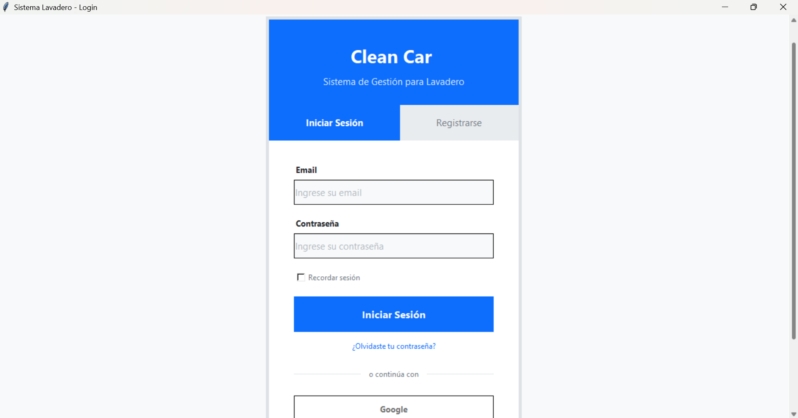
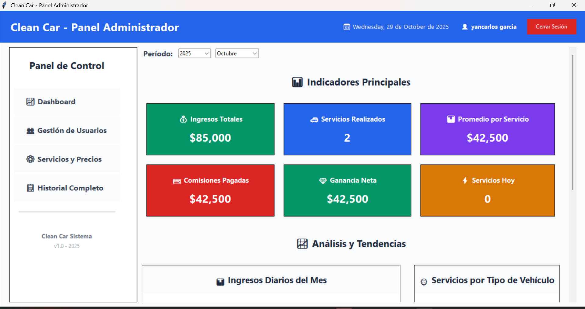
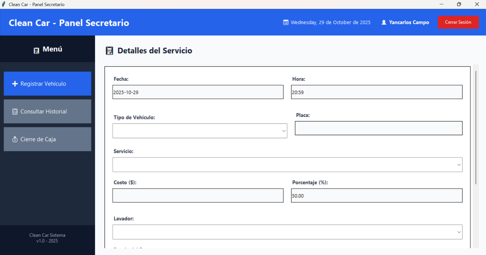

# 🚗 Clean Car - Sistema de Gestión de Lavadero


Sistema de escritorio para la gestión integral de un lavadero de vehículos, desarrollado en Python con Tkinter y MySQL. Permite administrar usuarios, servicios, precios, registros de lavados, comisiones de lavadores y reportes financieros.

---

## 📋 Tabla de Contenidos

- [Características](#-características)
- [Requisitos](#-requisitos)
- [Instalación](#-instalación)
- [Configuración](#-configuración)
- [Estructura del Proyecto](#-estructura-del-proyecto)
- [Roles y Funcionalidades](#-roles-y-funcionalidades)
- [Uso del Sistema](#-uso-del-sistema)
- [Base de Datos](#-base-de-datos)
- [Capturas de Pantalla](#-capturas-de-pantalla)
- [Contribución](#-contribución)
- [Licencia](#-licencia)
- [Autores](#-autores)

---

## ✨ Características

### Generales
- 🔐 Sistema de autenticación con bcrypt
- 👥 Gestión de usuarios con roles (Administrador y Secretario)
- 🎨 Interfaz moderna y responsive
- 📊 Reportes y estadísticas en tiempo real
- 💾 Exportación de datos a Excel (XLSX)
- 🖨️ Generación de reportes imprimibles
- 📱 Navegación lateral intuitiva

### Administrador
- 📈 Dashboard con métricas clave (ingresos, servicios, comisiones)
- 👤 Gestión completa de usuarios (crear, editar, eliminar, activar/desactivar)
- 🚙 Gestión de servicios y precios por tipo de vehículo
- 📜 Consulta de historial completo
- 📊 Análisis de tendencias mensuales
- 💰 Control de ganancias y comisiones

### Secretario
- ➕ Registro rápido de servicios
- 🔍 Consulta de historial con filtros avanzados
- 💵 Cierre de caja diario
- ✏️ Edición de registros
- 📊 Estadísticas de lavadores y servicios
- 📥 Exportación de datos a Excel

---

## 🔧 Requisitos

### Software Necesario
- **Python 3.8+** (3.10 o superior recomendado)
- **MySQL 8.0+** o **MariaDB 10.5+**
- **XAMPP** (opcional, para facilitar la gestión de MySQL)

### Sistema Operativo
- Windows 10/11
- Linux (Ubuntu 20.04+, Fedora, etc.)
- macOS 10.15+

---

## 📦 Instalación

### 1. Clonar el Repositorio

```bash
git clone https://github.com/tu-usuario/clean-car-lavadero.git
cd clean-car-lavadero
```

### 2. Crear Entorno Virtual

```bash
# Windows
python -m venv venv
venv\Scripts\activate

# Linux/macOS
python3 -m venv venv
source venv/bin/activate
```

### 3. Instalar Dependencias

```bash
pip install -r requirements.txt
```

**Archivo `requirements.txt`:**
```txt
mysql-connector-python==8.2.0
bcrypt==4.1.1
python-dotenv==1.0.0
openpyxl==3.1.2
Pillow==10.1.0
```

### 4. Configurar Base de Datos

#### Opción A: Con XAMPP
1. Iniciar XAMPP
2. Activar MySQL
3. Abrir phpMyAdmin (http://localhost/phpmyadmin)
4. Crear base de datos `lavadero_db`
5. Importar el archivo `database/schema.sql`

#### Opción B: MySQL Manual
```bash
mysql -u root -p
CREATE DATABASE lavadero_db CHARACTER SET utf8mb4 COLLATE utf8mb4_unicode_ci;
USE lavadero_db;
SOURCE database/schema.sql;
```

### 5. Configurar Variables de Entorno

Crear archivo `.env` en la raíz del proyecto:

```env
# Configuración de Base de Datos
DB_HOST=localhost
DB_PORT=
DB_USER=
DB_PASSWORD=tu_password
DB_NAME=

# Configuración de Aplicación
APP_NAME=Clean Car
APP_VERSION=1.0
DEBUG=False
```

### 6. Ejecutar la Aplicación

```bash
python src/main.py
```

---

## 🗂️ Estructura del Proyecto

```
clean-car-lavadero/
│
├── README.md                      # Este archivo
├── requirements.txt               # Dependencias de Python
├── .env                          # Variables de entorno (no incluir en git)
├── .gitignore                    # Archivos ignorados por git
│
├── database/
│   ├── db_config.py              # Configuración de conexión MySQL
│   └── schema.sql                # Script de creación de BD
│
├── src/
│   ├── main.py                   # Punto de entrada de la aplicación
│   │
│   ├── auth/
│   │   └── login.py              # Sistema de login y registro
│   │
│   ├── admin/                    # Módulos del administrador
│   │   ├── __init__.py
│   │   ├── admin_panel.py        # Panel principal del admin
│   │   ├── base_module.py        # Clase base para módulos
│   │   ├── dashboard.py          # Dashboard con métricas
│   │   ├── usuarios.py           # Gestión de usuarios
│   │   ├── servicios.py          # Gestión de servicios y precios
│   │   └── history.py            # Historial completo
│   │
│   └── secretary/                # Módulos del secretario
│       ├── __init__.py
│       ├── secretary_panel.py    # Panel principal del secretario
│       ├── base_module.py        # Clase base para módulos
│       ├── register.py           # Registro de servicios
│       ├── history.py            # Consulta de historial
│       └── cash.py               # Cierre de caja diario
│
├── assets/                       # Recursos (imágenes, iconos)
│   └── logo.png
│
└── docs/                         # Documentación adicional
    ├── manual_usuario.md
    └── guia_instalacion.md
```

---

## 👥 Roles y Funcionalidades

### 🔑 Administrador

| Funcionalidad | Descripción |
|--------------|-------------|
| **Dashboard** | Vista general con KPIs principales: ingresos totales, servicios realizados, promedio por servicio, comisiones pagadas, ganancias netas, servicios hoy |
| **Gestión de Usuarios** | Crear, editar, eliminar y activar/desactivar usuarios. Cambiar roles (admin/secretario) |
| **Gestión de Servicios** | Crear servicios, definir precios por tipo de vehículo (moto, auto, camioneta, SUV, camión) |
| **Historial Completo** | Consultar todos los registros con filtros por fecha, placa, lavador, estado de pago |
| **Reportes** | Análisis de tendencias mensuales, estadísticas por lavador y servicios más solicitados |

### 📝 Secretario

| Funcionalidad | Descripción |
|--------------|-------------|
| **Registrar Vehículo** | Registrar servicios con validación de placas colombianas, selección de lavador, cálculo automático de comisiones |
| **Consultar Historial** | Búsqueda de registros con filtros por fecha, placa y lavador (últimos 100 registros) |
| **Cierre de Caja** | Resumen financiero diario, tabla de registros del día, edición/eliminación de registros, exportación a Excel, reporte imprimible |

---

## 🖥️ Uso del Sistema

### Primer Inicio

1. **Ejecutar la aplicación:**
   ```bash
   python src/main.py
   ```

2. **Crear primer usuario (Administrador):**
   - Clic en "Registrarse"
   - Ingresar datos (nombre, email, contraseña)
   - El primer usuario se crea como **secretario** por defecto
   - Un administrador debe cambiar el rol desde la BD o desde el panel de usuarios

3. **Login:**
   - Ingresar email y contraseña
   - El sistema detecta el rol y carga el panel correspondiente

### Registro de Servicios (Secretario)

1. Ir a **"Registrar Vehículo"**
2. Seleccionar tipo de vehículo
3. Los servicios se cargan automáticamente
4. Ingresar placa (opcional, formato: ABC123 o ABC12D)
5. Seleccionar servicio (el costo se actualiza automáticamente)
6. Seleccionar lavador (opcional)
7. Configurar porcentaje de comisión (default: 50%)
8. Marcar si está pagado
9. Agregar observaciones (opcional)
10. Clic en **"Registrar Servicio"**

### Cierre de Caja (Secretario)

1. Ir a **"Cierre de Caja"**
2. Ver resumen del día: ingresos, comisiones, balance neto, servicios realizados
3. Revisar tabla de registros
4. **Editar registro:** Doble clic o clic derecho → Editar
5. **Eliminar registro:** Clic derecho → Eliminar
6. **Exportar a Excel:** Clic en "Exportar CSV" (ahora exporta XLSX)
7. **Imprimir reporte:** Clic en "Imprimir Reporte" → Vista previa → Guardar

### Gestión de Usuarios (Administrador)

1. Ir a **"Gestión de Usuarios"**
2. Ver lista de usuarios activos/inactivos
3. **Crear usuario:** Completar formulario → Guardar
4. **Editar usuario:** Seleccionar → Editar
5. **Cambiar rol:** Editar usuario → Cambiar rol (admin/secretario)
6. **Desactivar:** Seleccionar → Desactivar (no elimina, solo oculta)

### Gestión de Servicios (Administrador)

1. Ir a **"Servicios y Precios"**
2. **Crear servicio:** Nombre, descripción, categoría
3. **Definir precios:** Seleccionar servicio → Configurar precio por cada tipo de vehículo
4. **Editar/Eliminar:** Usar botones de acción

---

## 🗄️ Base de Datos

### Estructura Principal

#### Tabla `usuarios`
```sql
CREATE TABLE usuarios (
    id INT PRIMARY KEY AUTO_INCREMENT,
    nombre VARCHAR(100) NOT NULL,
    email VARCHAR(100) UNIQUE NOT NULL,
    password VARCHAR(255) NOT NULL,
    rol ENUM('admin', 'secretario') DEFAULT 'secretario',
    activo TINYINT DEFAULT 1,
    provider VARCHAR(50) DEFAULT 'local',
    created_at TIMESTAMP DEFAULT CURRENT_TIMESTAMP
);
```

#### Tabla `servicios`
```sql
CREATE TABLE servicios (
    id INT PRIMARY KEY AUTO_INCREMENT,
    nombre VARCHAR(100) NOT NULL,
    descripcion TEXT,
    categoria VARCHAR(50),
    activo TINYINT DEFAULT 1,
    created_at TIMESTAMP DEFAULT CURRENT_TIMESTAMP
);
```

#### Tabla `servicio_precios`
```sql
CREATE TABLE servicio_precios (
    id INT PRIMARY KEY AUTO_INCREMENT,
    id_servicio INT NOT NULL,
    tipo_vehiculo ENUM('motorcycle', 'car', 'pickup', 'suv', 'truck') NOT NULL,
    precio DECIMAL(10,2) NOT NULL,
    activo TINYINT DEFAULT 1,
    FOREIGN KEY (id_servicio) REFERENCES servicios(id) ON DELETE CASCADE,
    UNIQUE KEY unique_servicio_vehiculo (id_servicio, tipo_vehiculo)
);
```

#### Tabla `registros`
```sql
CREATE TABLE registros (
    id INT PRIMARY KEY AUTO_INCREMENT,
    fecha DATE NOT NULL,
    hora TIME NOT NULL,
    vehiculo VARCHAR(50),
    placa VARCHAR(10),
    id_servicio INT,
    costo DECIMAL(10,2),
    porcentaje DECIMAL(5,2) DEFAULT 50.00,
    lavador VARCHAR(100),
    observaciones TEXT,
    pago VARCHAR(20) DEFAULT 'Pendiente',
    id_usuario INT,
    created_at TIMESTAMP DEFAULT CURRENT_TIMESTAMP,
    FOREIGN KEY (id_servicio) REFERENCES servicios(id),
    FOREIGN KEY (id_usuario) REFERENCES usuarios(id)
);
```

#### Tabla `lavadores`
```sql
CREATE TABLE lavadores (
    id INT PRIMARY KEY AUTO_INCREMENT,
    nombre VARCHAR(50) NOT NULL,
    apellido VARCHAR(50) NOT NULL,
    telefono VARCHAR(20),
    activo TINYINT DEFAULT 1,
    created_at TIMESTAMP DEFAULT CURRENT_TIMESTAMP
);
```

#### Vista `vista_registros_completos`
```sql
CREATE VIEW vista_registros_completos AS
SELECT 
    r.id,
    r.fecha,
    r.hora,
    CASE 
        WHEN r.vehiculo = 'motorcycle' THEN 'Motocicleta'
        WHEN r.vehiculo = 'car' THEN 'Automóvil'
        WHEN r.vehiculo = 'pickup' THEN 'Camioneta'
        WHEN r.vehiculo = 'suv' THEN 'SUV'
        WHEN r.vehiculo = 'truck' THEN 'Camión'
    END as vehiculo_nombre,
    r.placa,
    s.nombre as servicio_nombre,
    r.costo,
    r.porcentaje,
    (r.costo * r.porcentaje / 100) as comision_calculada,
    (r.costo * (100 - r.porcentaje) / 100) as ganancia_neta,
    r.lavador,
    r.pago,
    u.nombre as usuario_nombre,
    r.observaciones
FROM registros r
LEFT JOIN servicios s ON r.id_servicio = s.id
LEFT JOIN usuarios u ON r.id_usuario = u.id;
```

---

## 📸 Capturas de Pantalla

### Login


### Dashboard Administrador


### Panel Secretario - Registro


### Cierre de Caja


---


### Guía de Estilo
- Usar PEP 8 para código Python
- Comentar funciones complejas
- Actualizar documentación con cambios importantes
- Escribir docstrings en español

---

## 📝 Licencia

Este proyecto está bajo la Licencia MIT. Ver el archivo [LICENSE](LICENSE) para más detalles.

---

## 👨‍💻 Autores

- **Yancarlos Campo** - *Desarrollo Principal* - [GitHub](https://github.com/yancarlos-campo)
- **Victorius** - *Arquitectura y Documentación*

---

## 🔄 Historial de Versiones

### v1.0.0 (28 de Octubre, 2025)
- ✅ Sistema de autenticación completo
- ✅ Panel de administrador con dashboard
- ✅ Panel de secretario con registro y cierre de caja
- ✅ Gestión de usuarios y servicios
- ✅ Exportación a Excel
- ✅ Reportes imprimibles
- ✅ Validación de placas colombianas

---

## 🎯 Roadmap

### v1.1.0 (Próxima versión)
- [ ] Integración con impresora térmica
- [ ] Gráficos de tendencias (matplotlib)
- [ ] Backup automático de BD
- [ ] Notificaciones por email
- [ ] Dashboard de lavadores

### v2.0.0 (Futuro)
- [ ] Versión web (Flask/Django)
- [ ] App móvil (React Native)
- [ ] Integración con pasarelas de pago
- [ ] Sistema de citas online
- [ ] CRM para clientes

---


### Cambiar Tema de Colores
En `src/utils/styles.py`:
```python
COLORS = {
    'primary': '#2563eb',    # Azul
    'success': '#059669',    # Verde
    'danger': '#dc2626',     # Rojo
    'warning': '#f59e0b',    # Naranja
    'info': '#0891b2'        # Cyan
}
```

---

## 🛠️ Solución de Problemas

### Error: "No se pudo conectar a la base de datos"
**Solución:**
1. Verificar que MySQL esté corriendo
2. Revisar credenciales en `.env`
3. Probar conexión manual: `mysql -u root -p`

### Error: "Module not found"
**Solución:**
```bash
pip install -r requirements.txt
```

### Error: "bind_all" en canvas
**Solución:**
- Usar `bind()` en lugar de `bind_all()`
- Ver commit #abc123 para detalles

### Exportar Excel no funciona
**Solución:**
```bash
pip install openpyxl
```

---

**⭐ Si este proyecto te fue útil, considera darle una estrella en GitHub**

**Made with ❤️ by Victorius & Yancarlos**